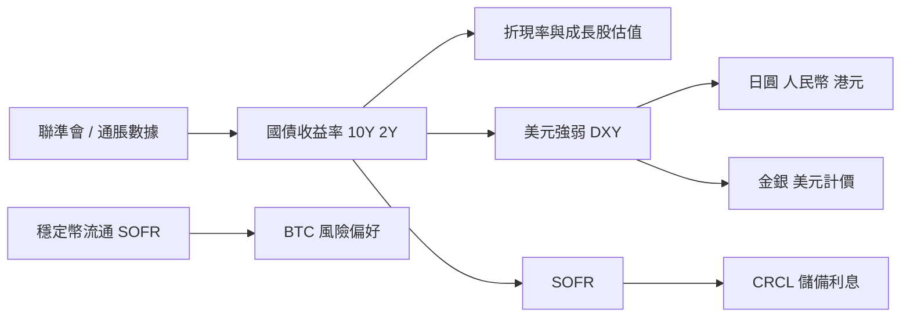

# 觀察板 · 資料關聯性總覽

> 更新：**2026-05-30** · [correlations.json](./correlations.json)（邏輯邊）· [correlations-computed.json](./correlations-computed.json)（股間 r）

**非投資建議** · 統計相關≠因果

## 1. 觀察板上有哪些資料？

| 資料 | 檔案 | 在板上的用途 |
|------|------|----------------|
| 國債 / SOFR | `yields.json` | 無風險利率、曲線形狀、CRCL 利息敏感度 |
| 四幣匯率 | `forex.json` | 美元、人民幣、日元、港元敘事與避險 |
| 穩定幣流通 | `stablecoins.json` | 鏈上美元流動性、USDC vs USDT、CRCL 連動 |
| 即時報價 | `prices.json` | 當日漲跌、橫向比較 |
| 日線 OHLC | `ohlc.json` | K 線、KDJ、回撤、**股間相關係數** |
| 公司數字 | `metrics.json` | `rateSens`、營收結構 → 對利率/敘事敏感度 |
| Reddit 情緒 | `sentiment.json` | 討論量與多空粗分（噪音大） |
| 期權 | `options.json` | P/C、到期、籌碼與短期波動 |
| 日曆 | `calendar.json` | CPI/FOMC、財報、OPEX |
| 綜合新聞 | `news-digest.json` | 敘事與標的映射 |

## 2. 宏觀傳導（邏輯鏈）



- **利率 ↑**：通常壓 **長久期成長股**（NVDA、PLTR、SNOW 等）；**短久期、現金流穩**相對抗跌。
- **美元 ↑**：新興市場貨幣壓力；**金**常受壓但避險時可同漲；**日圓**另受 BOJ 與利差支配。
- **曲線倒掛 vs 陡峭化**：倒掛多解讀為緊縮後段；陡峭化可能伴隨再通脹或寬鬆預期——需搭配 **通脹與增長** 一起看。

## 3. 跨資產對照（與觀察名單的關係）

| 因子 | 與誰最相關 | 關係方向（典型） |
|------|------------|------------------|
| **10Y 名義利率** | 高估值成長股、長久期敘事 | 利率 ↑ → 估值壓力（負向） |
| **SOFR** | USDC 流通、CRCL | 同向（儲備收益） |
| **美元** | 金、銀、日圓、人民幣 | 商品美元計價常反向；匯率成對解讀 |
| **BTC** | 風險偏好、流動性 | 與納指 **階段性** 正相關；與 **IREN** 等基本面相關更直接 |
| **穩定幣總量** | DeFi/槓桿、場外美元 | 縮表時風險資產易承壓 |
| **OPEX** | 當週 Gamma、單標的 | 局部波動，與宏觀 r 不同維度 |

## 4. 微觀：同一板塊內

- **AI / 算力鏈**（NVDA、AMD、GOOGL、ANET、VRT…）：營收與 capex 敘事重疊 → **日報酬相關常偏高**（見下方腳本輸出）。
- **SMCI / IREN**：波動大、受 **單公司事件 + BTC（IREN）** 影響，與純雲端軟體股相關不穩定。
- **CRCL**：與 **SOFR、穩定幣流通** 同一邏輯軸，與 AI 股的相關是「風險資產 beta」而非產業鏈。

## 5. 情緒與新聞

- **Reddit / Stocktwits**：偏 **短線噪音**；極端情緒偶為反向指標。
- **news-digest**：驗證敘事是否進入價格；與 **calendar** 財報日疊加時解讀力較高。

## 6. 如何更新「股間相關係數」？

先更新 K 線資料，再跑：

```bash
cd research/ten-bagger
node scripts/update-ohlc.mjs   # 若本機有 Yahoo 抓取流程
node scripts/analyze-correlations.mjs
node scripts/prepare-pages.mjs
```

---

<!-- CORR_COMPUTED_START -->
## 股間相關係數（腳本計算）

> 資料：**2026-05-29** · 1y · 日報酬 Pearson · 僅含同 t 對齊樣本 n≥30

| 標的對 | r | 樣本數 |
|--------|---|--------|
| AMD / ARM | +0.53 | 250 |
| NVDA / VRT | +0.51 | 250 |
| AMD / SMCI | +0.48 | 250 |
| AMD / NVDA | +0.48 | 250 |
| NVDA / SMCI | +0.46 | 250 |
| ARM / SMCI | +0.45 | 250 |
| AMD / IREN | +0.42 | 250 |
| PLTR / SNOW | +0.40 | 250 |
| AMD / VRT | +0.39 | 250 |
| ARM / NVDA | +0.39 | 250 |
| AMD / POET | +0.38 | 250 |
| CRCL / PLTR | +0.37 | 246 |
| NVDA / PLTR | +0.37 | 250 |
| ANET / VRT | +0.37 | 250 |
| ARM / POET | +0.36 | 250 |

- **正相關高**：同產業敘事、同 beta（例如 AI / 算力鏈）常同漲跌。
- **負相關**：較少見；可能反映資金在板塊內輪動或對沖結構（樣本短時不穩）。

完整 JSON：[correlations-computed.json](./correlations-computed.json)

<!-- CORR_COMPUTED_END -->

---

## 延伸閱讀

- [國債 yields.md](./yields.md) · [穩定幣 stablecoins.md](./stablecoins.md) · [匯率 forex.md](./forex.md)
